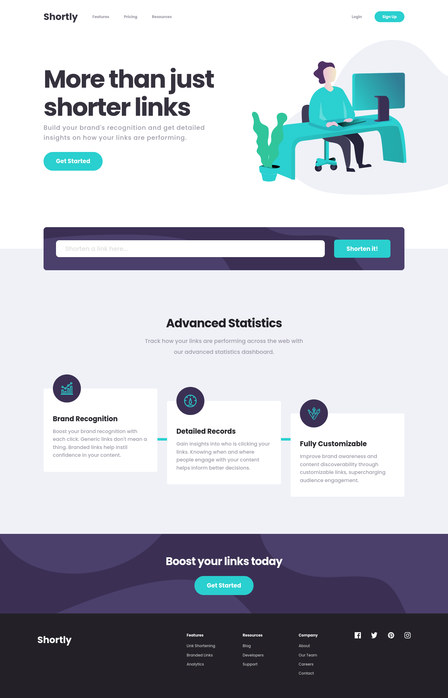

# Frontend Mentor - Shortly URL shortening API Challenge solution

This is a solution to the [Shortly URL shortening API Challenge challenge on Frontend Mentor](https://www.frontendmentor.io/challenges/url-shortening-api-landing-page-2ce3ob-G). Frontend Mentor challenges help you improve your coding skills by building realistic projects.

## Table of contents

-   [Overview](#overview)
    -   [The challenge](#the-challenge)
    -   [Screenshot](#screenshot)
    -   [Links](#links)
-   [My process](#my-process)
    -   [Built with](#built-with)
    -   [What I learned](#what-i-learned)
-   [Author](#author)

## Overview

### The challenge

Users should be able to:

-   View the optimal layout for the site depending on their device's screen size
-   Shorten any valid URL
-   See a list of their shortened links, even after refreshing the browser
-   Copy the shortened link to their clipboard in a single click
-   Receive an error message when the `form` is submitted if:
    -   The `input` field is empty

### Screenshot



### Links

-   Solution URL: [URL](https://github.com/okcomputer93/url-shortening)
-   Live Site URL: [URL](https://okcomputer93.github.io/url-shortening)

### Built with

-   Semantic HTML5 markup
-   Flexbox
-   SASS
-   [Vue](https://vuejs.org/) - JS Framework

### What I learned

In this project I used some Vue skills, almost every part that is meant to be reusable (element or layout) is a component. As a plus I added a functional menu in small screen devices.

Some code I'm proud of:

```js
name: "ButtonPrimary",
props: ["href", "styles", "type", "disabled"],
render(createElement) {
        const element = this.styles.split("-")[0];
        return createElement(
            element,
            {
                attrs: {
                    class: `button__primary ${this.shape}`,
                    href: this.href,
                    type: this.type,
                    disabled: this.disabled,
                },
            },
            this.$slots.default
        );
    },
```

In order to make the ButtonPrimary a component capable of being a button or a link, I used the render function that Vue offers to create a dynamic html element with certains props and attributes, like so this component can be rendered as an anchor or as a button of type button or submit.

## Author

-   Github - [@okcomputer93](https://github.com/okcomputer93)
-   Frontend Mentor - [@okcomputer93](https://www.frontendmentor.io/profile/okcomputer93)
